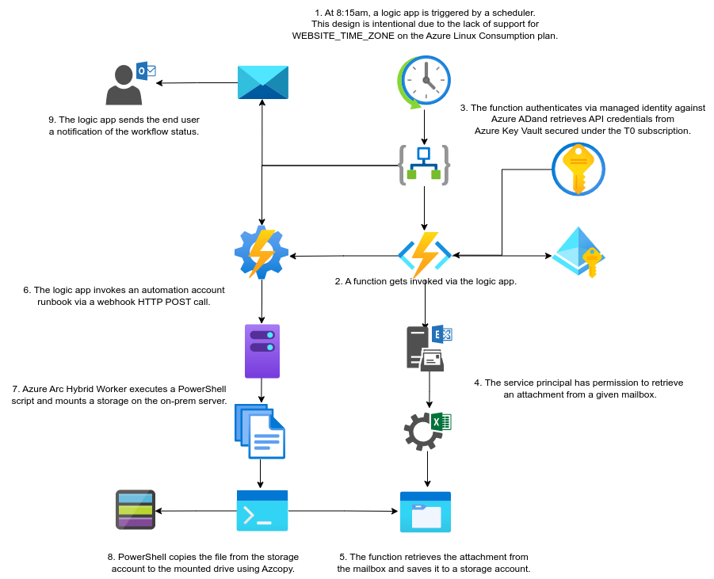

# VICGOV - Azure Go Fex
## 1. Introduction
### 1.1	Overview

A number of challenges arise when managing AAD roles across multiple tenants, Hosting Services team have been working to make this process easier to maintain with less administrative overhead.

This document is intended to provide a high level overview of workflow on how the automation transfers files from Gofex SFT client to Sharepoint dir https://****.sharepoint.com/sites/****/****/Technical Documents/GoFex Reporting and notifies the admins with job status alert email.

Included in this report is a step by step detailed guide around where to look for troubleshooting.

## 2 Go Fex Sharepoint Integration Process Reports
- Description: MS Sharepoint integration from the on-prem server..
- Priority: 3
- Owners: Tier 0

## 3 Logical Architecture
### 3.1	Logical System Component Overview

1. The file gets dumped from the application.
1. Azure Automation account runs AzCopy script every hour to transfer the file from on-prem to Azure Blob via Hybrid Runbook Workers.
1. This invokes a function via eventgrid. 
1. The function will auth via managed identity against Azure AD and retrieves API credentials from Azure Keyvault that is secured under T0 subscription.
1. SPN has permission on the BAS sharepoint site to upload a file.
1. The function will invoke logic app for notification email.

## Used By

This project is used by the following teams:

- BAS
- Cloud Platform